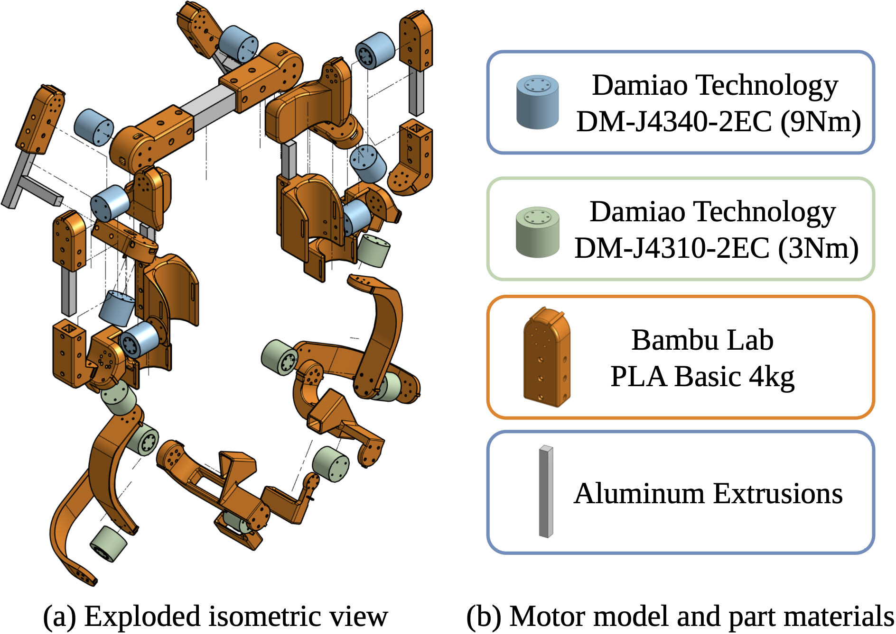
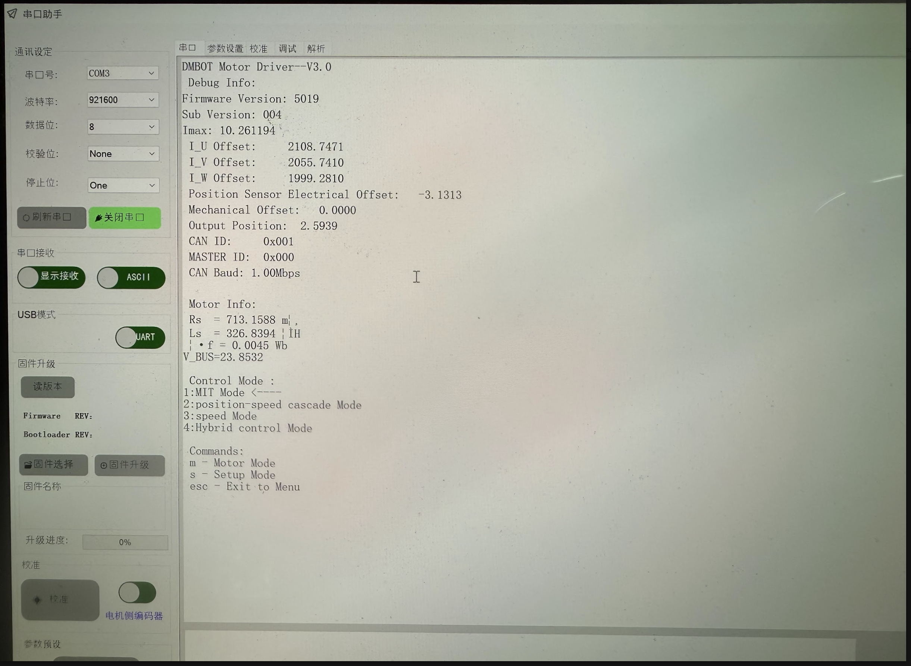
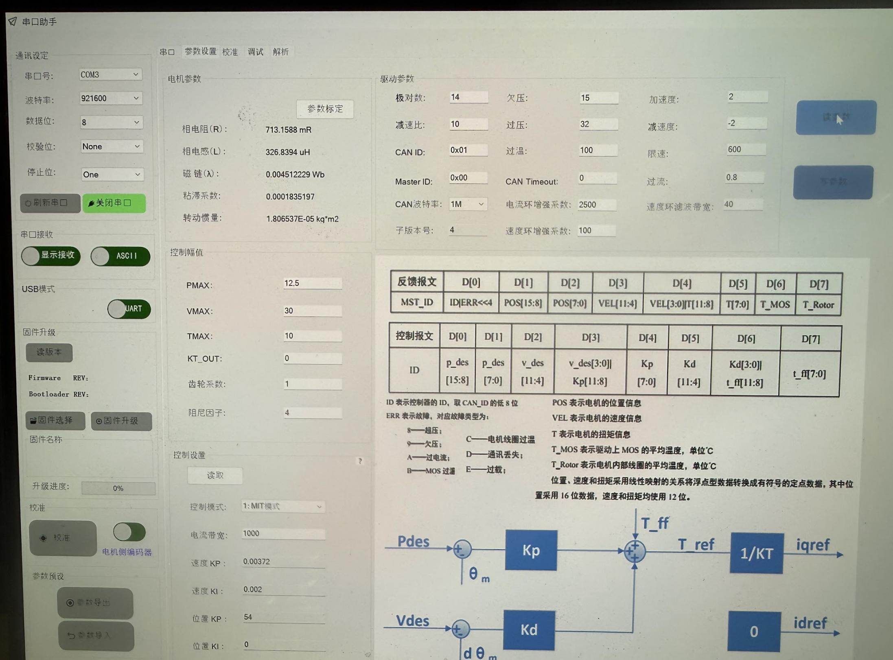

# Hardware Guide

## 1. Exoskeleton Parts Preparation:
1. Get the aluminum extrusions, screws, and actuators ready (checkout [paper](https://arxiv.org/pdf/2606.14218) Appendix E.2 for details)
2. Print all the orange parts in PLA basic, checkout [robot model](../robot/ume/v6_imu/models/robot.xml) for part 3D STL files

## 2. Exoskeleton Damiao Actuator Configuration:
Note: For each actuator, it is easier to configure them before installing, although you can still do that through the hole I left for the UART port on the actuator. Here are the steps you need to do to reproduce UME:
1. Download and open [DM tool](https://github.com/dmBots/motor-debugging-tool/tree/7406da26cb56b4c024039f85fde6f7a086ac7e11/Windows/x86_64)
2. Connect the actuator UART port to the [DM UART to USB-C adapter](https://item.taobao.com/item.htm?id=639679565187), then to your PC. Set your DC power supply to 24V and get ready to power on the actuator.

3. Click "open serial port" （打开串口）, it'll turn green and change to "close serial port"（关闭串口）.

4. Power on the actuator. If this status report does not show up, it means the connection is not successful. Try another USB-C cable.

5. Click Parameter settings（参数设置） in the top selection bar, then click Read parameters（读参数）.

6. For the ith actuator on each arm (from shoulder to gripper 1-8), lets use an example of the elbow actuator (the 1st)
   1. Set CAN-ID to 0x01 (0x0i for ith)
   2. Set master ID to 0x11 (0x1i for ith)
   3. Click "write parameter"（写参数）. You should see a window pop up saying "parameter write successful"（参数写入成功）
   
7. Go back to the "serial port"（串口） tab in the top selection bar. Set communication frequency to 5Mbps.
   1. Type "s" in the command window below and click send
   2. Type "FCB9" to set the comm frequency to 5Mbps
   3. Power cycle the actuator, you should see a status report that has all the above changes applied. (CAN ID, MASTER ID, CAN BAUD)
   
8. You have successfully configured this actuator. Now repeat the above steps for all the right arm (1-8) and left arm (1-8) actuators.

## 3. Exoskeleton Fabrication & Assembly:

3D printing files checkout: [ume_step folder](../robot/ume/ume_step). Also, please feel free to change the arm length to fit your arm better!

3D printing notes:
1. Use Bambu PLA basic material
2. Slice with triangular pattern and 20% infill
3. It is recommended to use Orange PLA for better strength

I recommend mounting the shoulder onto the table and start assembling from shoulder to wrist. It is also helpful to follow the exploded view above to assemble the exoskeleton. Here are some tips to help you speed up the assembly process

1. For each actuator, use a screw that is ~5mm longer than the depth of screw hole on the PLA parts.
2. For shoulder J2 actuator, first thread the XT30 2+2 cable from J1 through the 2020 aluminum extrusion, then through the hole on the PLA part, then connnect it to J2. This hides the wire in the slot of aluminum extrusion.
3. For other actuators, first assemble and connect the wires. Then rotate the joint to the limit of human range of motion to find the minimum length of wire that needs to be free floating, then tape the wire down to anywhere on the exoskeleton that does not block your movements.
4. Mount the yahboom imu anywhere on the back of exoskeleton with x up y left z forward configuration.

Great! Now you have successfully assembled it. Let's zero all the actuators so they are consistent with software robot model.

## 4. Exoskeleton Actuator Zeroing

1. Print the Zeroing key (a block with a 5mm x 2.5mm x 100mm slot)
2. Find the bump before and after the actuator. Align them and hold them together with the key.
3. Run `ume/robot/ume/v6_bimanual/motor_chain_test.py` but change the `motor_ids` and `motor_types` to the one that you are working on. Then uncomment the `damiao_chain.set_zero()` line and run the code.
4. When running the code, you should see the actuator turn green. And the program outputs 0 for position reading.
5. Now you successfully zeroed this joint. Now repeat for all joints.
6. After you finished all the joints. Check your zeroing with `ume/robot/ume/v6_imu/real_teleop_sim.py`. For safety, make sure to zero out the torque command (change the torque multiplier before the tau_ff_R to 0 here `data_R = ume_R.mit_control(kp=q_zeros, kd=q_zeros, q=q_zeros, dq=q_zeros, tau=1 * tau_ff_R)`) for both arms.

Great! If everything look good, `ume/robot/ume/v6_imu/real_teleop_sim.py` should give correct gravity compensation. Try move the exoskeleton with your hand!
